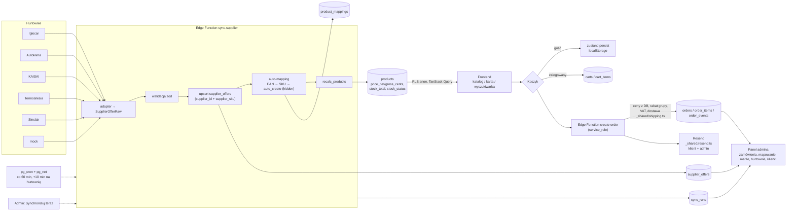
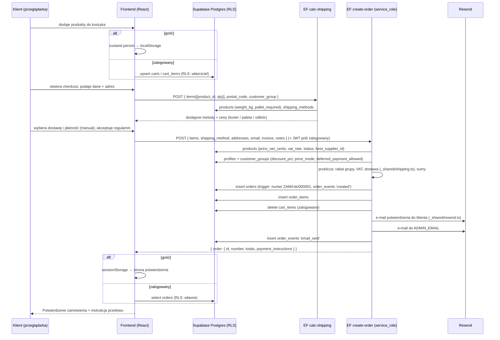

# Architektura — przepływ danych

Sklep HVAC (B2C + B2B). Stack: React 18 + Vite + TypeScript + Tailwind + shadcn/ui (frontend), Supabase (Postgres + RLS, Auth, Storage, Edge Functions w Deno, pg_cron + pg_net), Resend (e-mail).

Zasada nadrzędna: **źródłem prawdy cen i stanów jest baza danych** (`recalc_product`) oraz Edge Function `create-order`. Frontend tylko prezentuje dane; nigdy nie liczy VAT ani rabatów na potrzeby zamówienia.

## 1. Diagram przepływu danych



## 2. Synchronizacja hurtowni (`sync-supplier`)

1. Wejście: `{ supplierCode, source }` — z pg_cron (`source: 'cron'`) lub ręcznie z admina. Tworzony jest wiersz `sync_runs` (`status='running'`).
2. Adapter (`adapters/<code>.ts`) pobiera i parsuje feed do `SupplierOfferRaw[]`. Brak danych dostępowych → `NotConfiguredError` → `sync_runs.status='not_configured'`, `suppliers.last_sync_status='not_configured'`.
3. Walidacja zod rekord po rekordzie. Błędne rekordy trafiają do `sync_runs.errors`, nie przerywają runu.
4. Upsert do `supplier_offers` po kluczu `(supplier_id, supplier_sku)`. Oferty nieobecne w feedzie: `active=false`, `stock=0`.
5. Auto-mapping oferty do produktu: po `ean` → po `sku` → brak dopasowania zostawia `product_id = null` (kolejka mapowania w adminie). Przy `feed_config.auto_create_products = true` tworzony jest produkt `status='hidden'` i wpis `product_mappings(matched_by='auto_create')`.
6. `recalc_products(uuid[])` dla wszystkich dotkniętych produktów.
7. Zamknięcie `sync_runs` (`ok` / `failed`), aktualizacja `suppliers.last_sync_*`. Błąd krytyczny → e-mail do `ADMIN_EMAIL`.

## 3. Algorytm cen i stanów — `recalc_product(product_id)`

Funkcja SQL `SECURITY DEFINER` (migracja `20261006000001_schema.sql`). Przeliczana:
- po syncu (`recalc_products`),
- triggerem `supplier_offers_recalc_on_change` (zmiana `product_id`, `active`, `stock`, `purchase_net_cents`, `lead_time_days`, DELETE),
- triggerem `products_recalc_on_change` (zmiana `price_override_net_cents` lub `vat_rate`),
- `recalc_all_products()` (seed, naprawa).

### 3.1 Wybór oferty

Brane są tylko oferty `supplier_offers.active = true` z hurtowni `suppliers.active = true`. Sortowanie:

1. `stock > 0` (0) → `lead_time_days is not null` (1) → pozostałe (2),
2. `purchase_net_cents` rosnąco,
3. `suppliers.priority` rosnąco (niższa liczba = ważniejsza hurtownia).

Pierwsza oferta zostaje `best_supplier_id` / `purchase_net_cents`. W praktyce: **najtańsza oferta ze stanem > 0; jeśli brak — najtańsza z podanym czasem dostawy**.

### 3.2 Reguła marży — `resolve_margin_rule(product_id, supplier_id, brand_id, category_id)`

Aktywne `margin_rules` dostają wagę szczegółowości (`specificity`):

| scope | specificity |
|---|---|
| `product` (scope_id = produkt) | 500 |
| `supplier` (scope_id = wybrana hurtownia) | 400 |
| `brand` | 300 |
| `category` (dowolny przodek kategorii produktu, włącznie z nią) | `200 - depth` — bliższa kategoria wygrywa |
| `global` | 100 |

Wybór: `order by specificity desc, priority desc limit 1`. Brak reguły → marża 0 %, `min_margin_cents` 0.

### 3.3 Cena netto i brutto

```
jeśli price_override_net_cents is not null:
    price_net = price_override_net_cents            -- nadpisanie admina wygrywa zawsze
w przeciwnym razie, gdy jest oferta:
    price_net = greatest(
        round(purchase_net × (1 + margin_pct/100)),
        purchase_net + min_margin_cents
    )
brak oferty: price_net = null

price_gross = round(price_net × (1 + vat_rate/100))   -- vat_rate domyślnie 23
```

Wszystko w groszach (`integer`); zaokrąglenie do pełnego grosza, bez końcówek `.99`.

### 3.4 Stan magazynowy

`stock_total = sum(greatest(stock, 0))` po aktywnych ofertach (`-1` = nieznany → 0).

| warunek | `stock_status` |
|---|---|
| `stock_total > 3` | `in_stock` |
| `1 ≤ stock_total ≤ 3` | `low` |
| `stock_total = 0` i wybrana oferta ma `lead_time_days` | `on_order` |
| w pozostałych przypadkach | `unavailable` |
| `price_net is null` (brak oferty) | zawsze `unavailable` |

`products.lead_time_days` = `lead_time_days` wybranej oferty tylko gdy `stock_total = 0`; przy stanie > 0 jest `null`.

### 3.5 Odczyt katalogu z frontu (RPC publiczne)

| RPC | zastosowanie |
|---|---|
| `search_products(query, limit, offset)` | wyszukiwarka i podpowiedzi: tsvector (`simple` + `unaccent`, wagi nazwa/SKU/EAN A, marka B, opis C) + trigram na nazwie/SKU + dokładny EAN; zwraca `total_count` do paginacji |
| `product_facets(category_id, search)` | fasety listingu w jednym zapytaniu: wartości atrybutów filtrowalnych (`product_attributes_def`) z licznikami, marki, `price_min`/`price_max` (brutto), `total`, dostępność (`in_stock`+`low` / `on_order`) |
| `category_descendants(id)`, `category_ancestors(id)`, `category_product_counts()` | listing z podkategoriami, breadcrumbs, liczniki w mega menu |

Wszystkie są `stable`, nie `SECURITY DEFINER` — obowiązuje RLS (`products.status='active'`). Pozostałe zapytania (produkt po slugu, kategorie, marki, strony statyczne, metody dostawy) idą bezpośrednio przez PostgREST + TanStack Query.

## 4. Tryby cen B2C / B2B

| | B2C (`customer_groups.price_mode='gross'`) | B2B (`price_mode='net'`, wymaga `profiles.b2b_approved`) |
|---|---|---|
| Prezentacja | brutto (`price_gross_cents`), netto jako informacja dodatkowa | netto (`price_net_cents`), brutto jako informacja dodatkowa |
| Rabat | brak | `customer_groups.discount_pct` (seed: `b2b_standard` 5 %, `b2b_vip` 10 %) |
| Darmowa dostawa od | `shipping_methods.free_from_cents` (brutto) | `shipping_methods.free_from_cents_b2b` (netto) |
| Płatność | `manual` → `status='awaiting_payment'`, `payment_status='pending'` | jak B2C; jeśli `deferred_payment_allowed` → `status='processing'`, `payment_status='deferred'`, `payment_due_date = dzisiaj + 14 dni` |

Przebieg B2B: klient podaje NIP/firmę w koncie → trigger `profiles_protect_fields` ustawia `b2b_requested=true` → admin zatwierdza (`b2b_approved=true`, przypisuje `customer_group_id`, opcjonalnie `deferred_payment_allowed=true`). Do momentu zatwierdzenia klient widzi ceny B2C.

`create-order` zapisuje w `orders`: `customer_group_code`, `price_mode`, `discount_pct`, `subtotal_net_cents` (po rabacie), `shipping_net_cents`, `vat_cents`, `total_gross_cents`. Pozycje `order_items.price_net_cents` to cena jednostkowa netto **po rabacie**.

## 5. Checkout — diagram sekwencji



Uwagi:
- Frontend wysyła tylko `product_id` + `qty`. Ceny, VAT i rabat liczy wyłącznie `create-order` na podstawie DB.
- Nie ma polityki RLS INSERT na `orders` dla klientów — zamówienie może utworzyć tylko `service_role` (patrz `docs/rls.md`).
- Gość nie ma dostępu do swojego zamówienia w DB; dane potwierdzenia pochodzą z odpowiedzi funkcji.
- `payment-webhook` obsługuje notyfikacje imoje (podpis `hash(rawBody + serviceKey)`, mapowanie statusów) — patrz `docs/payments-imoje.md`; `create-payment` generuje ponowny link płatności.

## 6. Harmonogram pg_cron (`20261006000003_cron.sql`)

Funkcja `schedule_supplier_sync(code, cron)` (SECURITY DEFINER):
1. Sprawdza obecność rozszerzeń `pg_cron` i `pg_net` — brak → `NOTICE`, no-op (migracja działa też na lokalnym Postgresie).
2. Czyta z Vault sekrety `project_url` i `service_role_key` — brak → `NOTICE`, no-op.
3. `cron.unschedule` + `cron.schedule('sync-supplier-<code>', cron, net.http_post(<project_url>/functions/v1/sync-supplier, Authorization: Bearer <service_role_key>, body {supplierCode, source:'cron'}))`.

| job | cron | hurtownia |
|---|---|---|
| `sync-supplier-iglocar` | `0 * * * *` | Igłocar |
| `sync-supplier-autoklima` | `10 * * * *` | Autoklima |
| `sync-supplier-kaisai` | `20 * * * *` | KAISAI |
| `sync-supplier-termosilesia` | `30 * * * *` | Termosilesia |
| `sync-supplier-sinclair` | `40 * * * *` | Sinclair |
| `cleanup-expired-carts` | `15 3 * * *` | `cleanup_expired_carts()` — usuwa wygasłe koszyki bez `profile_id` |

Co 60 min, każda hurtownia przesunięta o 10 min (unikanie zderzeń z limitami API). Hurtownia `mock` nie ma joba cron.

Konfiguracja na projekcie Supabase:
```sql
-- Dashboard → Database → Extensions: włącz pg_cron i pg_net, następnie:
select vault.create_secret('https://<ref>.supabase.co', 'project_url');
select vault.create_secret('<service_role_key>', 'service_role_key');
-- ponowne uruchomienie migracji 0003 (lub ręcznie select public.schedule_supplier_sync('iglocar', '0 * * * *'); ...)
```

`TODO(ustalić)`: docelowe godziny syncu po otrzymaniu limitów API hurtowni. Wywołanie z cron pomija nieaktywne hurtownie (`suppliers.active=false` → funkcja kończy się statusem `not_configured`).

## 7. Zmienne środowiskowe i sekrety

### 7.1 Frontend (`.env`, publiczne — chronione przez RLS)

| zmienna | opis |
|---|---|
| `VITE_SUPABASE_URL` | URL projektu Supabase |
| `VITE_SUPABASE_PUBLISHABLE_KEY` | klucz anon |
| `SUPABASE_PROJECT_ID` | tylko dla `npm run db:types` |

### 7.2 Edge Functions (Supabase → Edge Function secrets, NIGDY w repo)

| sekret | używany przez | opis |
|---|---|---|
| `SUPABASE_URL`, `SUPABASE_SERVICE_ROLE_KEY`, `SUPABASE_ANON_KEY` | wszystkie | wstrzykiwane automatycznie przez Supabase |
| `RESEND_API_KEY` | `create-order`, `send-email`, `sync-supplier` (alerty) | klucz API Resend |
| `EMAIL_FROM` | `_shared/resend.ts` | adres nadawcy, np. `Sklep <zamowienia@domena.pl>` — `TODO(ustalić)` domena zweryfikowana w Resend |
| `ADMIN_EMAIL` | `create-order`, `sync-supplier` | adres powiadomień o nowych zamówieniach i błędach syncu |
| `SHOP_NAME` | e-maile, potwierdzenia | nazwa sklepu (branding klienta — `TODO(ustalić)`) |
| `SHOP_URL` | e-maile (linki do zamówienia, strony statyczne) | publiczny URL sklepu |
| `BANK_ACCOUNT_NUMBER` | `create-order` (provider `manual`) | numer rachunku do przelewu w instrukcji płatności — `TODO(ustalić)` |
| `PAYMENT_PROVIDERS` | `calc-shipping`, `create-order` | włączeni dostawcy, np. `manual,imoje` (domyślnie `manual`) |
| `IMOJE_MERCHANT_ID`, `IMOJE_SERVICE_ID`, `IMOJE_SERVICE_KEY`, `IMOJE_API_KEY`, `IMOJE_ENV`, `IMOJE_API_URL` | `create-order`, `create-payment`, `payment-webhook` | konfiguracja imoje (`docs/payments-imoje.md`) |
| `SUPPLIER_IGLOCAR_URL` / `_LOGIN` / `_PASSWORD` / `_FORMAT` | `sync-supplier` | dostęp do feedu — `TODO(ustalić)` |
| `SUPPLIER_AUTOKLIMA_*` | `sync-supplier` | j.w. |
| `SUPPLIER_KAISAI_*` | `sync-supplier` | j.w. |
| `SUPPLIER_TERMOSILESIA_*` | `sync-supplier` | j.w. |
| `SUPPLIER_SINCLAIR_*` | `sync-supplier` | j.w. |
| `FAKTUROWNIA_API_TOKEN` | faza 3 | nieużywany w MVP |

### 7.3 Vault (Postgres)

| sekret | opis |
|---|---|
| `project_url` | URL projektu, używany przez `schedule_supplier_sync` |
| `service_role_key` | klucz service_role dla `net.http_post` z pg_cron |

## 8. Środowisko lokalne (bez Dockera)

W tym środowisku nie ma Dockera, więc `npx supabase start` / `supabase db reset` nie działają. Zamiennik:

| skrypt | co robi |
|---|---|
| `scripts/db-local-shim.sql` | tworzy role `anon` / `authenticated` / `service_role` (bypassrls), schemat `auth` z tabelą `auth.users` i funkcją `auth.uid()` czytającą `request.jwt.claim.sub`, schemat `vault` z tabelą `vault.decrypted_secrets`. **Nie wdrażać na projekt Supabase.** |
| `scripts/db-local-reset.sh` | `drop schema public cascade` → shim → wszystkie `supabase/migrations/*.sql` → `supabase/seed.sql`. Domyślnie `PGHOST=127.0.0.1 PGPORT=5499 PGUSER=postgres` (Postgres 16). |
| `scripts/gen-types-local.sh` | `supabase gen types typescript --db-url $PG_URL --schema public > src/integrations/supabase/types.ts`. |

```bash
./scripts/db-local-reset.sh
PG_URL=postgresql://postgres@127.0.0.1:5499/postgres?sslmode=disable ./scripts/gen-types-local.sh
```

Na prawdziwym projekcie Supabase: `npx supabase db push` oraz `npm run db:types` (wymaga `SUPABASE_PROJECT_ID`). Migracja `0003` na lokalnym Postgresie tylko loguje `NOTICE` (brak pg_cron/pg_net).

Symulacja użytkownika przy testach RLS na lokalnej bazie:
```sql
set role authenticated;
set request.jwt.claim.sub = '<uuid z auth.users>';
-- ... zapytania ...
reset role; reset request.jwt.claim.sub;
```
